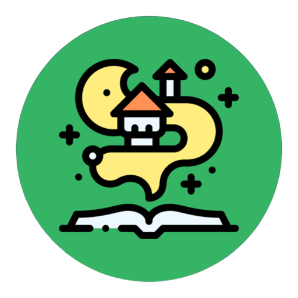

<div align="center"><p>
  


# TaleKeeper
   


</p></div>

TaleKeeper is an Android application designed for readers that love keeping track of their books. It allows users to discover new books, track their reading, and manage their personal library in a clean, modern interface.

---

## Table of Contents

- [About The Project](#about-the-project)
- [Key Features](#-key-features)
- [Screenshots](#-screenshots)
- [Architecture & Tech Used](#️-architecture--tech-used)
- [Getting Started](#-getting-started)
  - [Prerequisites](#prerequisites)
  - [Installation & Setup](#installation--setup)

---

## About The Project

This application serves as a complete mobile companion for book lovers. Users can browse an extensive catalog, get daily recommendations, and organize books into personal lists like "To Be Read," "Reading," and "Read." The app is built with modern Android development practices, featuring a robust architecture and a seamless user experience that adapts to user preferences like language and theme.

---

## ✨ Key Features

### Core Functionality
* **Explore & Discover:** Browse a vast catalog of books.
* **Filter & Sort:** Find books by **Genre** (Fantasy, Sci-Fi, etc.) or **Language** (English, Spanish).
* **Book of the Day:** Get a daily "Spotlight" book recommendation on the home screen.
* **Smart Search:** Quickly find any book by its title or author.
* **Detailed Information:** View a book's cover, synopsis, author, publication year, and more.
* **Request a Book:** Users can request new books to be added to the database.

### User Account & Personalization
* **Full Account Management:** Secure user registration, login, and profile management via Firebase Authentication.
* **Personalized Lists:** Organize books into `To Be Read`, `Reading`, and `Read` lists. These lists are mutually exclusive for clear tracking.
* **Favorites List:** Keep a special collection of your most-loved books.
* **Profile Stats:** See a count of your books in each list right from your profile.
* **Account Actions:** Users can change their password or delete their account.

### UI & UX
* **Light & Dark Theme:** Switch between themes for comfortable reading. Your choice is saved across sessions.
* **Multi-Language Support:** The UI is available in both **English** and **Spanish**, with the preference saved.
* **Responsive Design:** Clean and intuitive layouts that work across different screen sizes.
* **Modern Navigation:** Built with Jetpack Navigation Component for a smooth, single-activity experience.

---

## 📸 Screenshots


---

## 🛠️ Architecture & Tech Used

This app is built with a modern and robust architecture, prioritizing separation of concerns, scalability, and maintainability.

### Architecture
* **MVVM (Model-View-ViewModel):** The core architecture separates UI logic (View) from business logic (ViewModel) and data sources (Model/Repository).
* **Repository Pattern:** A single source of truth for all app data, abstracting data sources (Firebase) from the ViewModels.

### Tech Used
* **Language:** **Java**
* **Core:** Android SDK
* **Jetpack Components:**
    * **ViewModel:** To manage UI-related data in a lifecycle-conscious way.
    * **LiveData:** To build observable data flows that automatically update the UI.
    * **Navigation Component:** To handle all in-app navigation.
    * **Data Binding & View Binding:** To bind UI components in layouts to data sources, reducing boilerplate code.
    * **AppCompatDelegate:** For theme (Light/Dark) and language management.
    * **SharedPreferences:** For persisting user settings like theme and language choice.
* **Backend:**
    * **Firebase Realtime Database:** NoSQL cloud database for storing book and user data.
    * **Firebase Authentication:** For handling user sign-up, login, and management.
* **UI & Image Loading:**
    * **Material Design 3:** For modern and responsive UI components.
    * **RecyclerView:** For efficiently displaying large lists of data.
    * **Glide:** For fast and efficient image loading and caching.

---

## 🚀 Getting Started

To get a local copy up and running, follow these simple steps.

### Prerequisites

* **Android Studio:** Make sure you have the latest version of Android Studio installed.
* **Firebase Account:** You'll need a free Firebase account to connect the backend.

### Installation & Setup

1.  **Clone the Repository**
    ```sh
    git clone https://github.com/carlos-31/TaleKeeper.git
    cd TaleKeeper
    ```

2.  **Configure Firebase**
    This project uses Firebase, but the `google-services.json` config file is not included for security reasons. You must create your own.

    1.  Go to the [Firebase Console](https://console.firebase.google.com/) and click **"Add project"**.
    2.  In your new project, click the **Android icon** to add an Android app.
    3.  Enter the package name of the application (you can find it in `app/build.gradle` under `applicationId`).
    4.  Download the generated **`google-services.json`** file.
    5.  Place the downloaded `google-services.json` file in the **`app/`** directory of your project.
    6.  In the Firebase Console, navigate to the **Authentication** section and enable the **"Email/Password"** sign-in provider.
    7.  Navigate to the **Realtime Database** section, create a database, and select **"Start in test mode"** for initial read/write access.

3.  **Set Up the Database Structure**
    The app requires a specific data structure in the Realtime Database to function.

    1.  In the repository, locate the file named **`realtime_database_example.json`**. This file contains the schema and sample data.
    2.  In your Firebase Realtime Database, click the three-dot menu and select **"Import JSON"**.
    3.  Upload the `realtime_database_example` file.

4.  **Build and Run**
    You're all set! Open the project in Android Studio, let Gradle sync, and run the app on an emulator or a physical device.
